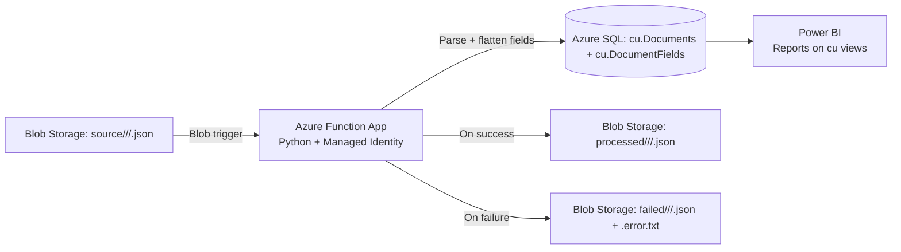

# Content Understanding Confidence Logger

Ingest Azure AI **Content Understanding** label/extraction JSON into **Azure SQL** so every
extracted field (and its confidence score) is queryable and reportable from **Power BI**.
Originals are moved from a `source` container to `processed` (or `failed`) once handled.



## What gets stored

For every JSON file ingested:

| Table              | Purpose                                                                 |
| ------------------ | ----------------------------------------------------------------------- |
| `cu.Documents`     | One row per document — usecase, analyzer, filename, blob path, mime, …  |
| `cu.DocumentFields` | One row per extracted field — field name, value, **confidence**, spans |

Re-ingesting the same blob path **upserts** (replaces) — safe to replay.

## Blob naming convention

The usecase and analyzer come from the blob path:

```
source/<usecase>/<analyzer>/<file>.json
       └─ invoices                    -> usecase
                  └─ contoso-invoice-v3 -> analyzer
                                         └─ file.json -> document_name
```

The `displayName` in the JSON `metadata` block is used as the document name when present;
otherwise the filename is used.

## Power BI

Connect Power BI Desktop → **Azure SQL Database** → enter the server name & DB →
authenticate (Microsoft account / Entra ID). Pick from these views:

| View                       | Use                                                            |
| -------------------------- | -------------------------------------------------------------- |
| `cu.vw_DocumentFields`    | Flat fact table — one row per field. Main reporting surface.   |
| `cu.vw_DocumentSummary`   | One row per document — avg/min/max confidence, field count.    |
| `cu.vw_LowConfidenceFields`| Fields below 0.7 — review queue.                              |
| `cu.vw_FieldStatsByAnalyzer` | Per-analyzer / per-field-name confidence stats over time.    |

## Deploy

```powershell
# from repo root
azd auth login
azd init -e dev                       # only the first time
azd env set AZURE_LOCATION australiaeast   # pick any region with Azure SQL + Functions
azd up
```

`azd up` will:

1. Provision storage (with `source`, `processed`, `failed` containers), Azure SQL
   (Entra-only auth, **you** become the SQL admin), App Insights, and a Linux
   Consumption Python Function App.
2. Grant the Function App's Managed Identity `Storage Blob Data Owner`,
   `Storage Queue Data Contributor`, and `Storage Table Data Contributor`
   on the storage account (required for identity-based `AzureWebJobsStorage`).
3. Build and deploy the Python function code.

### Python package gotcha (Linux Y1 Consumption)

`azd deploy` for Linux Consumption Python does **not** package wheels — it
uploads source only and relies on Oryx remote build, which isn't always reliable
on Y1. If `az functionapp function list -g <rg> -n <func>` returns 0 after
deploy, build and stage the package manually:

```bash
# from repo root (Linux/WSL recommended for matching wheels)
rm -rf /tmp/funcpkg && mkdir /tmp/funcpkg && cp -r src/* /tmp/funcpkg/
cd /tmp/funcpkg
pip install --target ./.python_packages/lib/site-packages \
  --platform manylinux_2_17_x86_64 --python-version 3.11 \
  --only-binary=:all: --implementation cp -r requirements.txt
zip -r -q /tmp/funcpkg.zip .

# upload + point the Function App at it (MI-based)
SA=stcucdevXXXXXXXX   # your storage account
FUNC=func-cuc-dev-XXXXXXXX
RG=rg-dev
az storage container create --account-name $SA --name app-package --auth-mode login
az storage blob upload --account-name $SA --container-name app-package \
  --name funcpkg.zip --file /tmp/funcpkg.zip --auth-mode login --overwrite
az functionapp config appsettings set -g $RG -n $FUNC --settings \
  WEBSITE_RUN_FROM_PACKAGE=https://$SA.blob.core.windows.net/app-package/funcpkg.zip \
  WEBSITE_RUN_FROM_PACKAGE__credential=managedidentity \
  SCM_DO_BUILD_DURING_DEPLOYMENT=false ENABLE_ORYX_BUILD=false
az functionapp restart -g $RG -n $FUNC
```

### One-time post-deploy steps

Two SQL steps are needed once (Azure can't fully automate Entra DB users via Bicep):

1. Grant the Function App's Managed Identity access to the DB
2. Create the schema and views

Full T-SQL and instructions: [sql/README.md](sql/README.md).

After that, drop a JSON file into:

```
<storage>/source/<usecase>/<analyzer>/<file>.json
```

and it will appear in `cu.Documents` + `cu.DocumentFields` within seconds, and
move to `<storage>/processed/<usecase>/<analyzer>/<file>.json`.

## Manual test checklist

Use this sequence to validate a new deployment quickly:

1. Upload a valid CU JSON file to `source/<usecase>/<analyzer>/<file>.json`.
2. Wait 5-30 seconds.
3. Confirm success path: blob moved to `processed/<usecase>/<analyzer>/<file>.json`.
4. Confirm failure path (if triggered): blob moved to `failed/<usecase>/<analyzer>/<file>.json` and `failed/<usecase>/<analyzer>/<file>.json.error.txt` exists.
5. Validate SQL rows in `cu.Documents` and `cu.DocumentFields`.

Common pitfall: uploading to `source/<file>.json` (missing `<usecase>/<analyzer>`) will not trigger ingestion.

## Local dev

See [src/README.md](src/README.md).

## Layout

```
.
├── azure.yaml                  # azd project manifest
├── infra/
│   ├── main.bicep              # entry — RG-scope
│   ├── main.parameters.json
│   └── modules/
│       ├── storage.bicep
│       ├── sql.bicep
│       ├── function.bicep
│       └── monitoring.bicep
├── sql/
│   ├── 01_schema.sql           # tables + upsert procs
│   ├── 02_views.sql            # Power BI views
│   └── README.md               # post-deploy SQL steps
└── src/
    ├── function_app.py         # blob trigger
    ├── ingestion.py            # JSON -> rows (handles both CU formats, recursive)
    ├── sql_client.py           # pyodbc + MI
    ├── storage_client.py       # blob copy + delete (= move)
    ├── host.json
    ├── requirements.txt
    ├── local.settings.json.sample
    └── README.md
```
