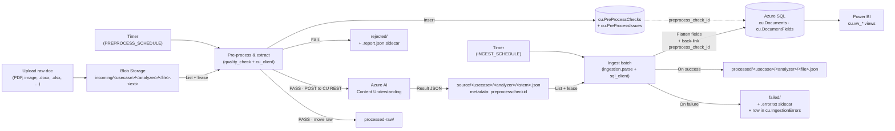

# Content Understanding Confidence Logger

End-to-end pipeline for **Azure AI Content Understanding** with built-in
**document quality gating** and confidence logging into **Azure SQL** for
**Power BI** reporting.

Two **timer-driven** Azure Function loops cover the full flow:

1. **Pre-process & extract** — picks raw uploads from the `incoming` container,
   runs a local quality checker, persists the result, and only **passing**
   documents are submitted to Content Understanding. Rejected docs are routed
   to `rejected/` with a JSON report next to them. Successful CU results are
   written to the `source/` container, stamped with metadata that back-links
   them to the originating quality check row.
2. **Ingest** — picks CU result JSON from `source/`, flattens every extracted
   field and confidence into `cu.Documents` / `cu.DocumentFields`, back-links
   to the originating `cu.PreProcessChecks` row, and moves the JSON to
   `processed/`.



> **Drop in at any stage.** If you already have CU output JSON, upload it
> straight to `source/<usecase>/<analyzer>/<file>.json` and the ingest loop
> will pick it up — the pre-process loop is a separate optional front-end.

## What gets stored

For every JSON file ingested:

| Table                   | Purpose                                                                          |
| ----------------------- | -------------------------------------------------------------------------------- |
| `cu.Documents`          | One row per document — usecase, analyzer, filename, blob path, mime, …           |
| `cu.DocumentFields`     | One row per extracted field — field name, value, **confidence**, spans          |
| `cu.PreProcessChecks`   | One row per quality check — score, band, pass/fail, CU submission outcome       |
| `cu.PreProcessIssues`   | One row per detected issue — code, severity, message, optional JSON details     |
| `cu.IngestionErrors`    | One row per failed ingest / CU submission                                       |

Re-ingesting the same blob path **upserts** (replaces) — safe to replay.

## Blob naming convention

The usecase and analyzer come from the blob path:

```
source/<usecase>/<analyzer>/<file>.json
       └─ invoices                    -> usecase
                  └─ contoso-invoice-v3 -> analyzer
                                         └─ file.json -> document_name
```

The `displayName` in the JSON `metadata` block is used as the document name when present;
otherwise the filename is used.

## Power BI

Connect Power BI Desktop → **Azure SQL Database** → enter the server name & DB →
authenticate (Microsoft account / Entra ID). Pick from these views:

| View                            | Use                                                                       |
| ------------------------------- | ------------------------------------------------------------------------- |
| `cu.vw_DocumentFields`          | Flat fact table — one row per field. Main reporting surface.              |
| `cu.vw_DocumentSummary`         | One row per document — avg/min/max confidence, field count.               |
| `cu.vw_LowConfidenceFields`     | Fields below `LOW_CONFIDENCE_THRESHOLD` (default 0.7).                    |
| `cu.vw_FieldStatsByAnalyzer`    | Per-analyzer / per-field-name confidence stats over time.                 |
| `cu.vw_DailyIngestion`          | Daily volume + average confidence + error count.                          |
| `cu.vw_PreProcessChecks`        | Per-document quality check + CU submission outcome.                       |
| `cu.vw_PreProcessIssues`        | Every issue raised by `quality_check.py` (with severity + code).          |
| `cu.vw_RejectedDocuments`       | Quality-rejected docs (never reached CU).                                 |
| `cu.vw_PreProcessDailySummary`  | Daily pre-process volume + pass/fail rate.                                |

## Deploy

```powershell
# from repo root
azd auth login
azd init -e dev                       # only the first time
azd env set AZURE_LOCATION australiaeast   # pick any region with Azure SQL + Functions
azd up
```

`azd up` will:

1. Provision storage (with `source`, `processed`, `failed`, `incoming`,
   `rejected`, `processed-raw` containers), Azure SQL (Entra-only auth,
   **you** become the SQL admin), App Insights, and a Linux Consumption
   Python Function App.
2. Grant the Function App's Managed Identity `Storage Blob Data Owner`,
   `Storage Queue Data Contributor`, and `Storage Table Data Contributor`
   on the storage account (required for identity-based `AzureWebJobsStorage`).
3. Build and deploy the Python function code.

### Wire up Content Understanding (required for the preprocess loop)

The pre-process loop submits passing documents to Azure AI Content Understanding
over its REST API using the Function App's Managed Identity. Two one-time
steps are required:

```bash
RG=rg-dev
FUNC=func-cuc-dev-xxxxxxxx
AI=<your-ai-services-resource-name>   # an Azure AI Services / Cognitive Services account

# 1) Tell the Function App where CU lives.
ENDPOINT=$(az cognitiveservices account show -g $RG -n $AI --query properties.endpoint -o tsv)
az functionapp config appsettings set -g $RG -n $FUNC \
  --settings CU_ENDPOINT=$ENDPOINT

# 2) Grant the Function MI 'Cognitive Services User' on the CU resource.
FUNC_MI=$(az functionapp identity show -g $RG -n $FUNC --query principalId -o tsv)
AI_ID=$(az cognitiveservices account show -g $RG -n $AI --query id -o tsv)
az role assignment create --assignee-object-id $FUNC_MI \
  --assignee-principal-type ServicePrincipal \
  --role "Cognitive Services User" --scope $AI_ID
```

The CU analyzer ID is taken from the **second** path segment of each incoming
blob, e.g. `incoming/invoices/contoso-invoice-v3/sample.pdf` is submitted to
analyzer `contoso-invoice-v3`. Make sure the analyzer exists on the CU
resource before uploading.

### Python package gotcha (Linux Y1 Consumption)

`azd deploy` for Linux Consumption Python does **not** package wheels — it
uploads source only and relies on Oryx remote build, which isn't always reliable
on Y1. If `az functionapp function list -g <rg> -n <func>` returns 0 after
deploy, build and stage the package manually:

```bash
# from repo root (Linux/WSL recommended for matching wheels)
rm -rf /tmp/funcpkg && mkdir /tmp/funcpkg && cp -r src/* /tmp/funcpkg/
cd /tmp/funcpkg
pip install --target ./.python_packages/lib/site-packages \
  --platform manylinux_2_17_x86_64 --python-version 3.11 \
  --only-binary=:all: --implementation cp -r requirements.txt
zip -r -q /tmp/funcpkg.zip .

# upload + point the Function App at it (MI-based)
SA=stcucdevXXXXXXXX   # your storage account
FUNC=func-cuc-dev-XXXXXXXX
RG=rg-dev
az storage container create --account-name $SA --name app-package --auth-mode login
az storage blob upload --account-name $SA --container-name app-package \
  --name funcpkg.zip --file /tmp/funcpkg.zip --auth-mode login --overwrite
az functionapp config appsettings set -g $RG -n $FUNC --settings \
  WEBSITE_RUN_FROM_PACKAGE=https://$SA.blob.core.windows.net/app-package/funcpkg.zip \
  WEBSITE_RUN_FROM_PACKAGE__credential=managedidentity \
  SCM_DO_BUILD_DURING_DEPLOYMENT=false ENABLE_ORYX_BUILD=false
az functionapp restart -g $RG -n $FUNC
```

### One-time post-deploy steps

Two SQL steps are needed once (Azure can't fully automate Entra DB users via Bicep):

1. Grant the Function App's Managed Identity access to the DB
2. Create the schema and views

Full T-SQL and instructions: [sql/README.md](sql/README.md).

After that, drop one or more **raw documents** into:

```
<storage>/incoming/<usecase>/<analyzer>/<file>.<ext>     (PDF, image, .docx, .xlsx, .pptx, .txt)
```

On the next pre-process tick the file is quality-checked. If it passes, the
Function App calls Content Understanding, writes the result JSON to
`source/<usecase>/<analyzer>/<file>.json`, and moves the raw doc to
`processed-raw/`. The ingest loop then flattens the JSON into
`cu.Documents` + `cu.DocumentFields` and moves it to `processed/`.

If you already have CU output JSON (e.g. from `cu_curl_test.sh` or another
pipeline), drop it directly into:

```
<storage>/source/<usecase>/<analyzer>/<file>.json
```

The ingest loop will pick it up on the next tick.

### Schedules & batch tuning

| Setting                       | Default          | Notes                                                                                  |
| ----------------------------- | ---------------- | -------------------------------------------------------------------------------------- |
| `INGEST_SCHEDULE`             | `0 */15 * * * *` | NCRONTAB (UTC). Top of the hour + every 15 min. Use `0 */5 * * * *` for 5-min cadence. |
| `BATCH_MAX_FILES`             | `50`             | Max CU-result JSON blobs processed per ingest tick.                                    |
| `BATCH_TIME_BUDGET_SEC`       | `540`            | Soft cutoff (9 min) so the loop never bumps into the 10-min host timeout.              |
| `PREPROCESS_SCHEDULE`         | `0 */15 * * * *` | NCRONTAB (UTC) for the pre-process + CU submission loop.                               |
| `PREPROCESS_BATCH_MAX_FILES`  | `20`             | Max raw docs processed per pre-process tick. Each one may call CU + poll.              |
| `PREPROCESS_TIME_BUDGET_SEC`  | `540`            | Soft cutoff for the pre-process loop.                                                  |
| `PREPROCESS_MODE`             | `standard`       | `standard` or `pro`. Pro runs slower / deeper image quality heuristics.                |
| `PREPROCESS_STRICT`           | `false`          | If `true`, WARNING-level issues also reject the document.                              |
| `CU_ENDPOINT`                 | _(empty)_        | **Must be set.** e.g. `https://<resource>.cognitiveservices.azure.com`.                |
| `CU_API_VERSION`              | `2024-12-01-preview` | Content Understanding REST API version.                                            |

Change them with `az functionapp config appsettings set` (no redeploy needed).

## Manual test checklist

Use this sequence to validate a new deployment quickly:

1. Upload one or more valid CU JSON files to `source/<usecase>/<analyzer>/<file>.json`.
2. Wait for the next timer tick (up to 15 minutes with the default schedule),
   or invoke the function on demand. Two options:

   **Option A — admin endpoint (fast path used in our E2E test):**
   ```bash
   FUNC=func-cuc-dev-xxxxxxxx
   RG=rg-dev
   MASTER_KEY=$(az functionapp keys list -g $RG -n $FUNC --query masterKey -o tsv)
   curl -s -o /dev/null -w "%{http_code}\n" -X POST \
     -H "x-functions-key: $MASTER_KEY" -H "Content-Type: application/json" \
     -d '{"input":""}' \
     "https://$FUNC.azurewebsites.net/admin/functions/ingest_content_understanding_batch"
   # → 202 means accepted; the timer runs the batch loop asynchronously.
   ```

   **Option B — ARM `az rest`:**
   ```bash
   az rest --method post \
     --uri "https://management.azure.com/subscriptions/$SUB/resourceGroups/$RG/providers/Microsoft.Web/sites/$FUNC/functions/ingest_content_understanding_batch/invoke?api-version=2024-04-01" \
     --body '{}'
   ```

   Or temporarily tighten the schedule: `az functionapp config appsettings set -g $RG -n $FUNC --settings INGEST_SCHEDULE="*/30 * * * * *"` (every 30 s).

3. Confirm success path: blobs moved to `processed/<usecase>/<analyzer>/<file>.json`.
4. Confirm failure path (if triggered): blob moved to `failed/<usecase>/<analyzer>/<file>.json`, sidecar `failed/<usecase>/<analyzer>/<file>.json.error.txt` exists, **and** a row in `cu.IngestionErrors` is created.
5. Validate SQL rows. The `blob_path` column stores the **source-relative** path, even after the blob is moved to `processed/`:
   ```sql
   SELECT document_id, usecase, analyzer_name, document_name, status,
          field_count, avg_confidence, processed_blob_url, ingested_at
   FROM cu.Documents
   WHERE blob_path LIKE 'source/<usecase>/<analyzer>/%'
   ORDER BY ingested_at DESC;

   SELECT TOP 20 d.document_name, f.field_path, f.field_type,
                 f.value_string, f.value_number, f.confidence
   FROM cu.Documents d
   JOIN cu.DocumentFields f ON f.document_id = d.document_id
   WHERE d.blob_path LIKE 'source/<usecase>/<analyzer>/%'
   ORDER BY d.document_id, f.field_path;
   ```

Common pitfalls:
- Uploading to `source/<file>.json` (missing `<usecase>/<analyzer>`) is silently skipped — only blobs that match the three-segment layout are picked up.
- All five failed files in one tick? Check `cu.IngestionErrors.error_message` first — the common cause is SQL `publicNetworkAccess` drifting back to `Disabled` (see [sql/README.md](sql/README.md#network-requirement)).

### Known-good one-shot E2E (WSL/Azure CLI)

This is a copy/paste flow that was validated end-to-end with the production
analyze-result shape (`result.contents`):

```bash
# from repo root
set -e
set -a && . .azure/dev/.env && set +a

# 1) Start local host (identity-based) in a separate terminal
cat > src/local.settings.json <<EOF
{
  "IsEncrypted": false,
  "Values": {
    "FUNCTIONS_WORKER_RUNTIME": "python",
    "AzureWebJobsFeatureFlags": "EnableWorkerIndexing",
    "AzureWebJobsStorage__accountName": "$STORAGE_ACCOUNT_NAME",
    "AzureWebJobsStorage__blobServiceUri": "https://$STORAGE_ACCOUNT_NAME.blob.core.windows.net/",
    "AzureWebJobsStorage__queueServiceUri": "https://$STORAGE_ACCOUNT_NAME.queue.core.windows.net/",
    "AzureWebJobsStorage__tableServiceUri": "https://$STORAGE_ACCOUNT_NAME.table.core.windows.net/",
    "AzureWebJobsStorage__credential": "AzureCli",
    "SOURCE_CONTAINER": "source",
    "PROCESSED_CONTAINER": "processed",
    "FAILED_CONTAINER": "failed",
    "SQL_SERVER": "$SQL_SERVER",
    "SQL_DATABASE": "$SQL_DATABASE",
    "LOW_CONFIDENCE_THRESHOLD": "0.70",
    "INGEST_SCHEDULE": "*/30 * * * * *",
    "BATCH_MAX_FILES": "20",
    "BATCH_TIME_BUDGET_SEC": "60"
  }
}
EOF
# terminal B:
#   cd src && func start
# (locally we use a 30-second NCRONTAB so you don't wait 15 minutes between
#  uploads and verification)

# 2) Upload probe JSON (production analyze-result shape)
TS=$(date +%Y%m%d%H%M%S)
BLOB="e2e/local/cu-e2e-analyze-$TS.json"
cat > /tmp/cu-e2e-analyze-$TS.json <<EOF
{
  "id": "op-$TS",
  "status": "succeeded",
  "result": {
    "analyzerId": "invoice-analyzer-v1",
    "apiVersion": "2024-11-30",
    "createdAt": "2026-05-20T11:08:00Z",
    "contents": [
      {
        "path": "input1",
        "fields": {
          "InvoiceId": {"type": "string", "valueString": "A-100", "confidence": 0.99},
          "Total": {"type": "number", "valueNumber": 123.45, "confidence": 0.97}
        }
      }
    ]
  }
}
EOF
az storage blob upload --auth-mode login --account-name "$STORAGE_ACCOUNT_NAME" \
  -c source -n "$BLOB" -f /tmp/cu-e2e-analyze-$TS.json --overwrite -o none
echo "Uploaded: source/$BLOB"

# 3) Verify storage movement
SRC_EXISTS=$(az storage blob exists --auth-mode login --account-name "$STORAGE_ACCOUNT_NAME" -c source -n "$BLOB" --query exists -o tsv)
PROCESSED_EXISTS=$(az storage blob exists --auth-mode login --account-name "$STORAGE_ACCOUNT_NAME" -c processed -n "$BLOB" --query exists -o tsv)
FAILED_EXISTS=$(az storage blob exists --auth-mode login --account-name "$STORAGE_ACCOUNT_NAME" -c failed -n "$BLOB" --query exists -o tsv)
echo "source=$SRC_EXISTS"
echo "processed=$PROCESSED_EXISTS"
echo "failed=$FAILED_EXISTS"

# 4) Verify SQL rows
sqlcmd -S "tcp:$SQL_SERVER,1433" -d "$SQL_DATABASE" -G -N -Q "
SET NOCOUNT ON;
SELECT TOP 1 d.document_id, d.usecase, d.analyzer_name, d.content_path, d.field_count, d.ingested_at
FROM cu.Documents d
WHERE d.blob_path = 'source/$BLOB'
ORDER BY d.ingested_at DESC;

SELECT COUNT(*) AS field_rows
FROM cu.DocumentFields f
INNER JOIN cu.Documents d ON d.document_id = f.document_id
WHERE d.blob_path = 'source/$BLOB';"
```

Expected outcome:

- `source=false`
- `processed=true`
- `failed=false`
- one `cu.Documents` row for `source/$BLOB` and `field_rows > 0`

## Local dev

See [src/README.md](src/README.md).

## Layout

```
.
├── azure.yaml                  # azd project manifest
├── infra/
│   ├── main.bicep              # entry — RG-scope
│   ├── main.parameters.json
│   └── modules/
│       ├── storage.bicep
│       ├── sql.bicep
│       ├── function.bicep
│       └── monitoring.bicep
├── sql/
│   ├── 01_schema.sql           # tables + upsert procs
│   ├── 02_views.sql            # Power BI views
│   └── README.md               # post-deploy SQL steps
└── src/
    ├── function_app.py         # timer trigger + batch loop + failure handling
    ├── ingestion.py            # JSON -> rows (handles both CU formats, recursive)
    ├── sql_client.py           # pyodbc + MI; usp_UpsertDocument / usp_FinalizeDocument / log_error
    ├── storage_client.py       # list + 60s lease + server-side copy + delete (= move)
    ├── host.json               # functionTimeout 00:10:00 (Y1 max)
    ├── requirements.txt
    ├── local.settings.json.sample
    └── README.md
```
