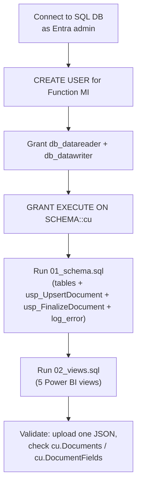

# SQL bootstrap

`azd up` provisions the SQL server and an empty database. Two manual steps are
needed once to (1) grant the Function's Managed Identity access and (2) create
the schema. They use the Entra admin set on the SQL server (your account).



## Network requirement

Current deployment expects the Function App to reach SQL over the public endpoint.
For this architecture to work, ensure:

- SQL server `publicNetworkAccess` is `Enabled`
- Firewall rule `AllowAzureServices` (`0.0.0.0` → `0.0.0.0`) exists

If you want SQL public access disabled, move to private networking (Function VNet
integration + SQL private endpoint).

### Symptom of misconfiguration

Every blob in a batch ends up in `failed/` with an `.error.txt` sidecar and a
matching row in `cu.IngestionErrors` whose `error_message` contains:

```
pyodbc.ProgrammingError ... (47073) ... "Connection was denied because Deny Public Network Access is set to Yes"
```

Fix — re-enable public access and (re)add the Azure-services firewall rule:

```bash
RG=rg-dev
SQL=sql-cuc-dev-xxxxxxxx
az sql server update -g $RG -n $SQL --enable-public-network true
az sql server firewall-rule create -g $RG -s $SQL -n AllowAzureServices \
  --start-ip-address 0.0.0.0 --end-ip-address 0.0.0.0
```

Then re-stage the failed blobs back into `source/` (or upload fresh copies) and
trigger the function again. The batch is idempotent — re-ingesting the same
`(blob_path, content_path)` upserts via `cu.usp_UpsertDocument`.

Note: in policy-governed subscriptions, `publicNetworkAccess` can drift back to
`Disabled` after a policy remediation run. If failures recur, check the SQL
server state first.

## 1. Grant the Function's Managed Identity access

The Function App's system-assigned Managed Identity needs `db_datareader` +
`db_datawriter` + execute on the procedures. Run this in **SSMS** or
**Azure Data Studio** connected to the SQL DB as the Entra admin:

```sql
-- Replace <FUNCTION_APP_NAME> with the actual name (azd env get-values).
CREATE USER [<FUNCTION_APP_NAME>] FROM EXTERNAL PROVIDER;
ALTER ROLE db_datareader ADD MEMBER [<FUNCTION_APP_NAME>];
ALTER ROLE db_datawriter ADD MEMBER [<FUNCTION_APP_NAME>];
GRANT EXECUTE ON SCHEMA::cu TO [<FUNCTION_APP_NAME>];
```

`<FUNCTION_APP_NAME>` is the Function App's display name (that's also the
service principal display name for a system-assigned identity).

## 2. Create the schema and views

Run, in order:

1. [01_schema.sql](01_schema.sql)
2. [02_views.sql](02_views.sql)

Both scripts are idempotent — safe to re-run after changes.

## 3. (Optional) Connect Power BI

1. Power BI Desktop → **Get Data** → **Azure SQL database**
2. Server: `<sql server>.database.windows.net`, Database: `<db>`
3. Auth: **Microsoft account** (Entra ID) — make sure your account has at
   least `db_datareader` on the DB.
4. Pick the views you want:
   - `cu.vw_DocumentFields` — main fact table (one row per extracted field)
   - `cu.vw_DocumentSummary` — one row per document
   - `cu.vw_LowConfidenceFields` — review queue (below `LOW_CONFIDENCE_THRESHOLD`)
   - `cu.vw_FieldStatsByAnalyzer` — field/analyzer trending
   - `cu.vw_DailyIngestion` — daily volume + quality
   - `cu.vw_PreProcessChecks` — quality-check rollup per document, including
     CU submission outcome and link back to the resulting `cu.Documents` row
   - `cu.vw_PreProcessIssues` — every issue raised by `quality_check.py`
   - `cu.vw_RejectedDocuments` — quality-rejected docs (never reached CU)
   - `cu.vw_PreProcessDailySummary` — daily pre-process volume + pass/fail rate

## 4. Inspecting ingestion failures

Every failure also writes an `.error.txt` sibling next to the blob in the
`failed` container. The same information is queryable from SQL:

```sql
SELECT TOP 20 occurred_at, error_kind, blob_path,
              usecase, analyzer_name, LEFT(error_message, 200) AS error_message
FROM cu.IngestionErrors
ORDER BY occurred_at DESC;
```

`error_kind` values: `ParseError`, `SqlError`, `MoveError`.
