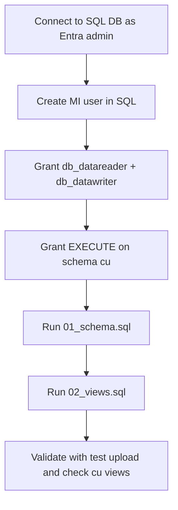

# SQL bootstrap

`azd up` provisions the SQL server and an empty database. Two manual steps are
needed once to (1) grant the Function's Managed Identity access and (2) create
the schema. They use the Entra admin set on the SQL server (your account).



## Network requirement

Current deployment expects the Function App to reach SQL over public endpoint.
For this architecture to work, ensure:

- SQL server `publicNetworkAccess` is `Enabled`
- Firewall rule `AllowAzureServices` (`0.0.0.0` to `0.0.0.0`) exists

If you want SQL public access disabled, move to private networking (Function VNet integration + SQL private endpoint).

## 1. Grant the Function's Managed Identity access

The Function App's system-assigned Managed Identity needs `db_datareader` +
`db_datawriter` + execute on the procedures. Run this in **SSMS** or
**Azure Data Studio** connected to the SQL DB as the Entra admin:

```sql
-- Replace <FUNCTION_APP_NAME> with the actual name (azd env get-values).
CREATE USER [<FUNCTION_APP_NAME>] FROM EXTERNAL PROVIDER;
ALTER ROLE db_datareader ADD MEMBER [<FUNCTION_APP_NAME>];
ALTER ROLE db_datawriter ADD MEMBER [<FUNCTION_APP_NAME>];
GRANT EXECUTE ON SCHEMA::cu TO [<FUNCTION_APP_NAME>];
```

`<FUNCTION_APP_NAME>` is the Function App's display name (that's also the
service principal display name for a system-assigned identity).

## 2. Create the schema and views

Run, in order:

1. [01_schema.sql](01_schema.sql)
2. [02_views.sql](02_views.sql)

Both scripts are idempotent — safe to re-run after changes.

## 3. (Optional) Connect Power BI

1. Power BI Desktop → **Get Data** → **Azure SQL database**
2. Server: `<sql server>.database.windows.net`, Database: `<db>`
3. Auth: **Microsoft account** (Entra ID) — make sure your account has at
   least `db_datareader` on the DB.
4. Pick the views you want:
   - `cu.vw_DocumentFields` — main fact table
   - `cu.vw_DocumentSummary` — one row per document
   - `cu.vw_LowConfidenceFields` — review queue
   - `cu.vw_FieldStatsByAnalyzer` — field/analyzer trending
   - `cu.vw_DailyIngestion` — daily volume + quality
