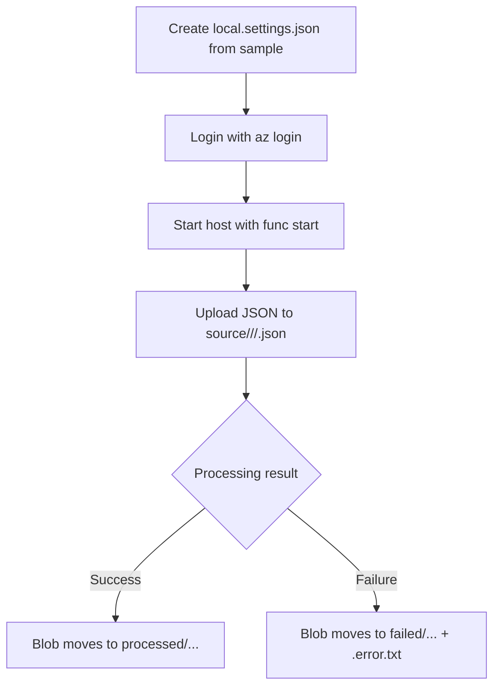

# Function app — local dev



## Prerequisites

- Python 3.11 (the deployed app uses 3.11 — match locally to avoid surprises)
- Azure Functions Core Tools v4
- ODBC Driver 18 for SQL Server  
  Windows: <https://learn.microsoft.com/sql/connect/odbc/download-odbc-driver-for-sql-server>  
  Linux/WSL: `curl ... msodbcsql18` per the same doc

## Setup

```powershell
cd src
python -m venv .venv
.\.venv\Scripts\Activate.ps1
pip install -r requirements.txt
Copy-Item local.settings.json.sample local.settings.json
# Edit local.settings.json — fill in your storage account name and SQL server
az login                       # so DefaultAzureCredential can get tokens
func start
```

Drop a JSON file into `<storage>/source/<usecase>/<analyzer>/<file>.json`
and watch the logs. After ingestion, the file lands in
`<storage>/processed/<usecase>/<analyzer>/<file>.json` (or `failed/...` on error).

Important: the blob path must include both `<usecase>` and `<analyzer>`. A flat path like
`source/file.json` is ignored by design.

## How it's wired

| File                | Purpose                                                            |
| ------------------- | ------------------------------------------------------------------ |
| `function_app.py`   | Blob trigger entry point + failure handling                        |
| `ingestion.py`      | Parses both CU formats and flattens leaves into rows               |
| `sql_client.py`     | Managed Identity → pyodbc connection; document + field writes      |
| `storage_client.py` | Server-side copy + delete (= move)                                 |
| `host.json`         | Functions host config (extension bundle, sampling)                 |
| `requirements.txt`  | Python dependencies                                                |

## Adding a new field type

`ingestion._VALUE_KEY` maps Content Understanding types to their `value<Type>`
key. To support a new type, add an entry there and a small branch in
`_build_leaf`. No SQL schema change is needed — typed columns are optional.
