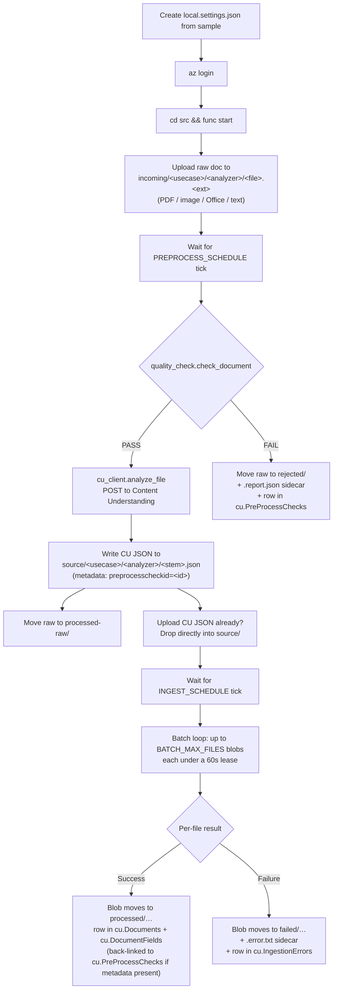

# Function app — local dev



## Prerequisites

- Python 3.11 (the deployed app uses 3.11 — match locally to avoid surprises)
- Azure Functions Core Tools v4
- ODBC Driver 18 for SQL Server  
  Windows: <https://learn.microsoft.com/sql/connect/odbc/download-odbc-driver-for-sql-server>  
  Linux/WSL: `curl ... msodbcsql18` per the same doc
- Optional but recommended for full quality-check coverage:
  PyMuPDF, Pillow, python-docx, openpyxl, python-pptx (all in `requirements.txt`)
- An Azure AI Services / Content Understanding resource with at least one
  analyzer defined; the local user (and the deployed Function MI) must have
  `Cognitive Services User` on the resource.

## Setup

```powershell
cd src
python -m venv .venv
.\.venv\Scripts\Activate.ps1
pip install -r requirements.txt
Copy-Item local.settings.json.sample local.settings.json
# Edit local.settings.json — fill in your storage account name, SQL server,
# and CU_ENDPOINT (e.g. https://<your-ai-services>.cognitiveservices.azure.com).
az login                       # so DefaultAzureCredential can get tokens
func start
```

**Pre-process + extract path** — drop a raw doc into
`<storage>/incoming/<usecase>/<analyzer>/<file>.<ext>` and watch the logs.
The pre-process trigger runs on `PREPROCESS_SCHEDULE` (default `*/30 * * * * *`
locally for fast feedback). On pass, the resulting CU JSON lands in
`source/<usecase>/<analyzer>/<stem>.json` stamped with metadata
`preprocesscheckid=<id>`. On fail, the raw doc moves to `rejected/` with a
sibling `.report.json` describing the issues.

**Direct ingest path** — if you already have CU output JSON, drop it into
`<storage>/source/<usecase>/<analyzer>/<file>.json`. The ingest trigger
(`INGEST_SCHEDULE`, default `*/30 * * * * *` locally) flattens it into
`cu.Documents` + `cu.DocumentFields` and moves it to `processed/` (or
`failed/` on error).

Important: every blob path must include both `<usecase>` and `<analyzer>`. A
flat path like `source/file.json` or `incoming/file.pdf` is silently skipped.

## How it's wired

| File                | Purpose                                                                          |
| ------------------- | -------------------------------------------------------------------------------- |
| `function_app.py`   | Two timer triggers (preprocess + ingest), per-blob lease, failure handling       |
| `quality_check.py`  | In-process document quality checker (PDF/image/Office/text). Pure stdlib at import; format libs lazily imported. |
| `cu_client.py`      | Content Understanding REST client (stdlib `urllib.request` + Managed Identity)   |
| `ingestion.py`      | Parses both CU formats and flattens leaves into rows                             |
| `sql_client.py`     | Managed Identity → pyodbc; document/field writes, preprocess persistence, errors |
| `storage_client.py` | List blobs, acquire short lease, server-side copy + delete, metadata read/write  |
| `host.json`         | Functions host config (extension bundle, sampling, 10-min timeout)               |
| `requirements.txt`  | Python dependencies                                                              |

## Adding a new field type

`ingestion._VALUE_KEY` maps Content Understanding types to their `value<Type>`
key. To support a new type, add an entry there and a small branch in
`_build_leaf`. No SQL schema change is needed — typed columns are optional.

## Adding a new quality check

All checks live in `quality_check.py`. Each format-specific helper
(`_check_pdf`, `_check_image`, `_check_docx`, …) takes the parsed document and
the in-flight `QualityReport`, and calls `report.add(QualityIssue(...))` with
a stable `code`, a `Severity`, a human message, and optional `details`. New
codes show up automatically in `cu.PreProcessIssues` and in the
`cu.vw_PreProcessIssueSummary` reporting view.

